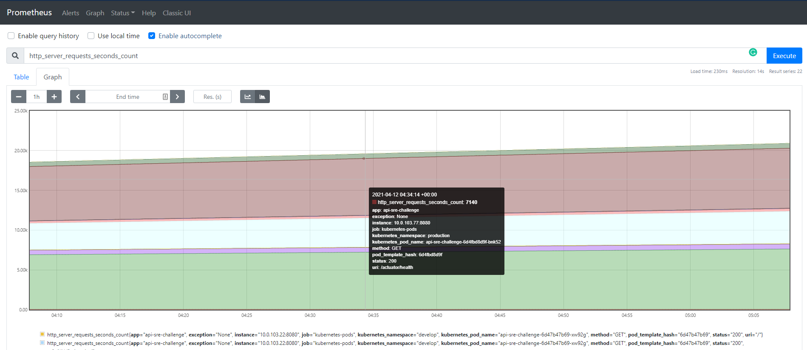

## SRE Challenge Solution
## Table of Contents

- [Overall Environment Design](#overall-environment-design)
- [Everything as Code](#everything-as-code)
    - [How to setup this environment](#how-to-setup-this-environment)
- [Development Workflow](#development-workflow)
- [The Pipeline](#the-pipeline)
    - [Stages/Steps](#stages/steps)
- [Observability](#observability)
- [Showcase](#showcase)
## Overall Environment Design


Given a Java Spring Boot application, a group of developers/testers will be working on a GitHub repository with a branching strategy defined in [Development Workflow](#development-workflow). With every commit, a Jenkins Multibranch Pipeline will be triggered, executing a series of steps defined in [The Pipeline](#the-pipeline). At the end of a successful pipeline run, and based on the branch, the application will be deployed to one of the three environments (develop, staging or production) deployed in AWS Elastic Kubernetes Service (EKS). This EKS cluster will have managed kubernetes nodes/workes that will elastically scale to meet demand requirements. Internally, there will be definitions of kubernetes resources for the application like Deployments, ReplicaSets, Services or Horizontal Pod Autoscalers, that will and guarantee the resiliency of the service. For [Observability](#observability), in each of the clusters there will be a namespace with resources for monitoring, metrics, alerts (Prometheus), and for analytics and interactive visualizations (Grafana).


## Everything as code

I tried to automate as much as possible. Filling up the *runtime.env* file will be enough to have the Jenkisn CI/CD environment completely configured (plugins, configurations, credentials and also the jenkins pipeline). I also provide Terraform code to deploy the Kubernetes application infrastructure and environment in the AWS cloud, using EKS.


### How to setup this environment

Requirements

| Name          | Version        | 
| ------------- |:--------------:| 
| Docker        | => 20.10.5     |
| Terraform     | => v0.14.10    |  
| aws-cli       | => 2.1.36      |  
| kubectl       | => 1.19        | 

I built a Jenkins image for this challenge that leverages the JCAC plugin to bundle all dependecies like plugins, configs and credentials. 
The latest image can be pulled from DockerHub at `davismar98/jenkins-challenge`

The image is fed with the environment variables located at `./jenkins/env/runtime.env`. Most of the variables are credentials. All of them are **required** in order to execute the pipeline successfully. 

We also will be running Docker commands, thus, it is required to run the Docker in Docker image, sharing the *jenkins* network. The commands are as follows: 

```
#Create bridge netword for Jenkins
docker network create jenkins

#Lauch the Docker In Docker container
docker run --name jenkins-docker --rm --detach \
  --privileged --network jenkins --network-alias docker \
  --env DOCKER_TLS_CERTDIR=/certs \
  --volume jenkins-docker-certs:/certs/client \
  --volume jenkins-data:/var/jenkins_home \
  --publish 2376:2376 docker:dind --storage-driver overlay2

#Launch custom Jenkins
docker run -d --rm --name jenkins  \
  -p 8080:8080 -p 50000:50000 --network jenkins  \
  -v jenkins-data:/var/jenkins_home -v jenkins-docker-certs:/certs/client:ro  \
  --env-file env/runtime.env davismar98/jenkins-challenge:latest
  
```
**NOTE**. This image can also be run in a Kubernetes cluster and use the Kubernetes Jenkins plugin to execute the jobs in pods. For the scope of the challenge I used a local deployment of Jenkins. 

To deploy the application infrastructure and environment, just setup the credentials for an AWS IAM user that has enough permissions to deploy VPC and EKS resources. Then, inside the `./terraform` directory run.

```
terraform init
terraform plan -out sre-challenge.tfplan
terraform apply sre-challenge.tfplan 
```

## Development Workflow


In order to guarantee a high level of consistenty in the application environments, developers should strictly follow the git flow branching strategy describe below. This is important since the Jenkins pipeline will executed the steps with conditionals based on the branch. 

### Branches
* **master/main**: stores the official release history of the application. This branch will be mapped to the *production environment*. 
* **develop**: serves as an integration branch for features. This branch will be mapped to the *development environment*. 
* **feature-\<ticket-number\>**: feature branches use develop as their parent branch. Each new feature should reside in its own branch, which can be pushed to the central repository for backup/collaboration. Jenkins will not deploy any changes until feature branches are merged to develop. 
* **release**:  When the develop branch has acquired new features for a release, those will be merged to the release branch. Testing and bug fixes will be perfomed on the branch. This branch will be mapped to the *stage environment*. Once the release is ready to ship to production, it will get merged it into master and develop.
* **hotfix\<ticket-number>**: used to quickly patch production releases. Similar behaviour to release branches and feature branches except they're based on master instead of develop. As soon as the fix is complete, it should be merged into both master and develop. Jenkins will not deploy any changes until hotfix branches are merged to master develop. 

## The Pipeline

For this challenge, I used Jenkins as the automation server for CI/CD. 

The pipeline is a Jenkins Multibranch Pipeline that will be constraint to run on specific branches patterns, according to the defined development branching strategy. 

You can find the fully functional *Jenkinsfile* in the [App Repostory](https://github.com/davismar98/apiSampleJava/blob/master/Jenkinsfile)
### Stages/Steps


1. **Compile** the Java Spring Boot application. I used Maven 3.6.3 installed a  tool in Jenkins.

2. **Unit Test**. Maven also is used for this stage. Although this app didn't iclude proper unit tests.

3. **Code Quality Analysis**. (TODO) Integration with a tool like SonarQube to inspect the quality of the code. 

4. **Application Security Test (SAST, SCA)**. (TODO) Integration with a tool like Veracode, Checkmarkx or Black Duck to perform Static application security testing to find flaws and security vulnerabilities. Also, to perform a Software Composition Analysis  for the purpose of risk management, security and license compliance withe opensource software.
 
5. **Build Docker Image**. A new image is created with the application name and tag (the short SHA of the git commit was used). Example: *davismar98/api-sre-challenge:b0514e3*. It only buils new images for branches develop, release and master/main.

6. **Test Docker Image**. Performs any test (scripts) that run inside the docker container to validate funcionality. 

7. **Deliver Docker image**. Pushes the image to my personal public Docker Hub *davismar98/api-sre-challenge*

8. **Remove local Docker images**. Performs a cleanup in the Jenkins executor node since the image is already in the registry.

9. [PARALLEL] **Deploy application to environment**. Since it is a Multibranch Pipeline, the step executed will be base on the current branch. Deployment will be as follows

    * *branch*:develop ==> *env*:develop
    * *branch*:release ==> *env*:staging
    * *branch*:master/main ==> *env*:production

Other branches like *hotfix/** or *feature** will only be build and tested, but not deployed.

For this step, Jenkins autheticated with AWS with an IAM user that has enough privileges to update resources within the EKS cluster (roles are mapped during the Terrafom execution).

10. **Slack notifications**. It will send a message with the output of the pipeline to a Slack channel. It allows continuous feedback to developers/testers.


## Observability

### Monitoring the application

In order to monitor the Sprint application it is needed to enable HTTP endpoints or the JMX, to  gather health, audit and metrics.

To do so, it was required to add the `spring-boot-actuator` and `micrometer-registry-prometheus` dependencies to integrate it with the monitoring solution with Prometheus and Grafana.

```
...
        <dependency>
            <groupId>org.springframework.boot</groupId>
            <artifactId>spring-boot-starter-actuator</artifactId>
        </dependency>
        <dependency>
            <groupId>io.micrometer</groupId>
            <artifactId>micrometer-registry-prometheus</artifactId>
        </dependency>
...
```
Also, by default, only healh and info web endpoints are exposed, so I had to add the entries in the `src/main/resources/application.yml` configuration file: 
```
...
endpoints:
    web:
      exposure:
        include: health, metrics, prometheus
...
```

With this config, we expose metrics like HTTP requests, errors, saturation and latency, that will used to generate promQL queries define **Service-Level Indicators and Objetives (SLIs and SLOs).** 

In the next section, I will show case the deployed solution and how these metrics are presented in Grafana dashboards.

### Monitoring the infrastructure

Since Prometheus and Grafana are deployed in the *monitoring* namespace of the clusters, we will be exporting metric for all kubernetes resources (i.e node-exporter). This will allow for a comprehensive view of the status of the application environment. Proactive monitoring and alerts will help guarantee a highly available and resilient enviroment with zero downtime. 

## Showcase 

Since I deployed the infrastrucute in an personal AWS, I cannot leave it running for you ($$$). I provided the instructions to deploy it yourself ([How to setup this environment](#how-to-setup-this-environment)), but in case you don't want to, I will be showcasing it in the upcoming sections:
### EKS deployment


Here, you can see the workloads present in the EKS cluster. 

### Kubernetes resources

Querying all the resources created in the *production* namespace. 2 pods, 1 service, 1 deployment, 1 replicaSet and 1 HPA.

### The deployed web app 

The application was expose with a service of type *LoadBalancer*, that way we can access it using a Classic Load Balancer provided by AWS. 

### The app exposing Promethus-formatted metrics through the actuator


### Prometheus scrapping the Spring Boot application

Here, we can start writing promQL queries to extract SLIs. 

### Grafana visualizations

With custom or imported dashboards, we can start observing what is going on in the environment and define alerts.
### Multibranching pipeline in action 


New jobs are being executed per branch. Jenkins will perfom the CI/CD in a fully automated way.


### Slack notifications for app owners

Receiving the results of the deployments in my *#challenge* channel in Slack.